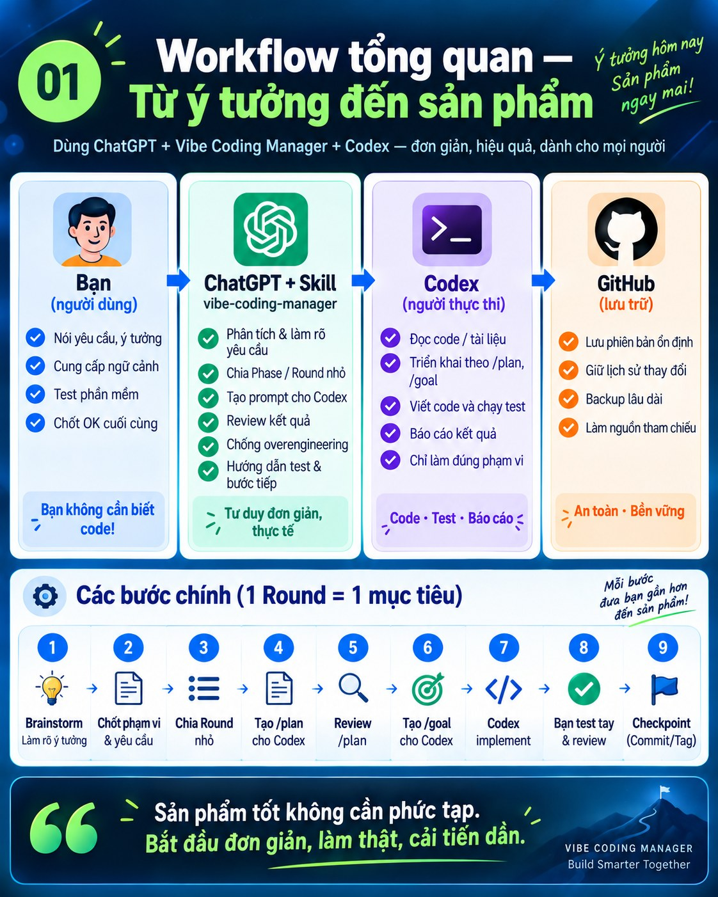
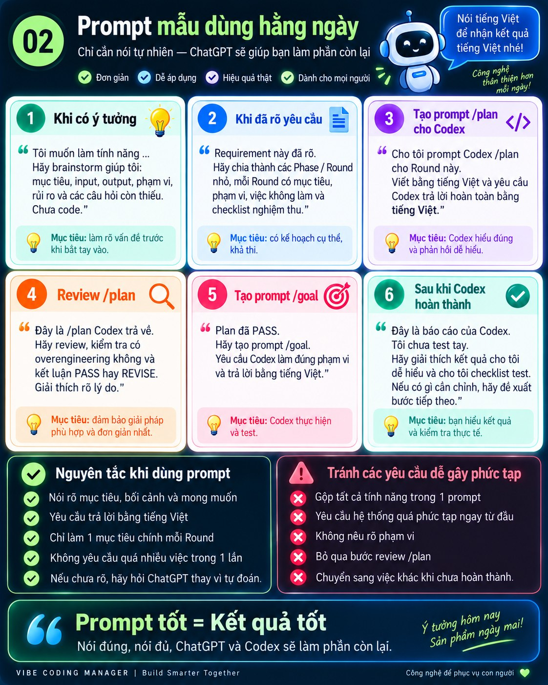
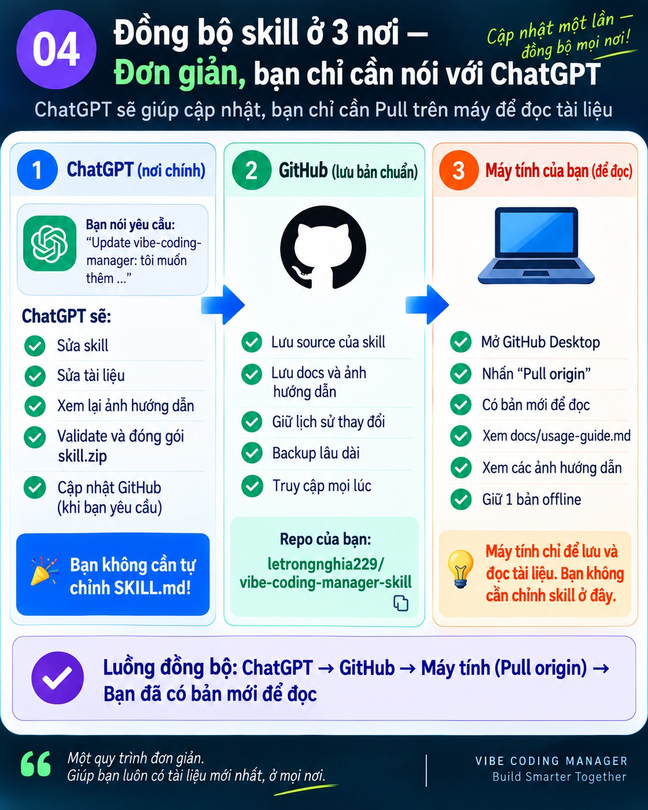
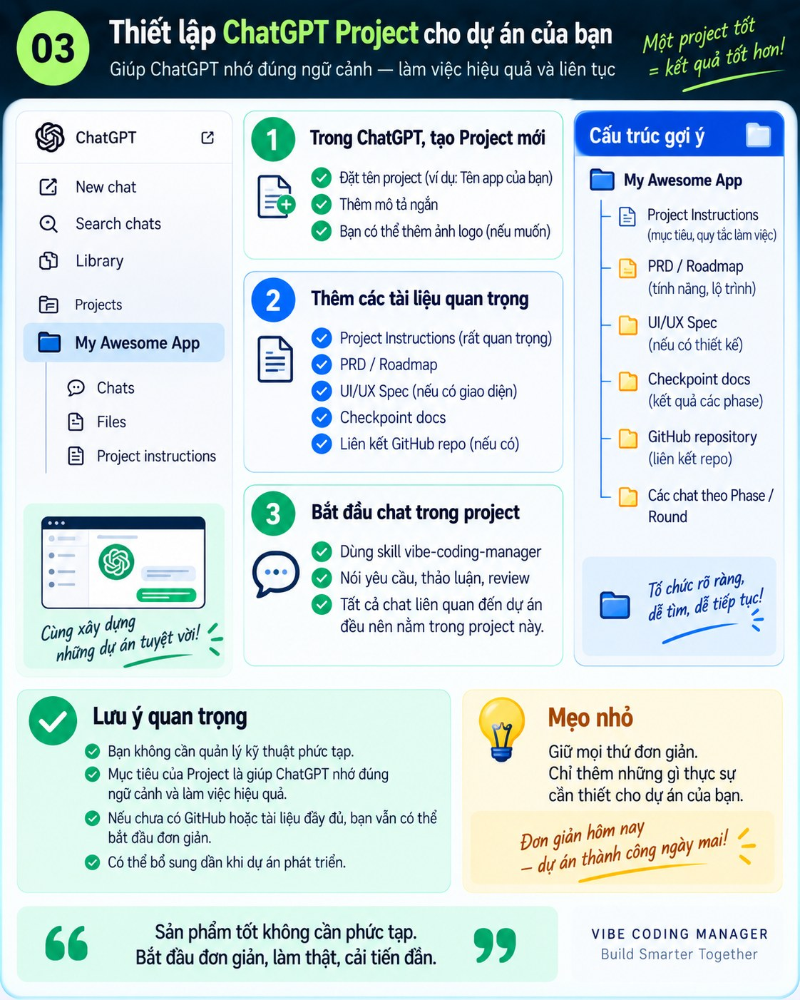

# Vibe Coding Manager — Hướng dẫn cho người không chuyên

`vibe-coding-manager` giúp bạn phát triển phần mềm bằng ChatGPT + Codex mà không cần tự biết lập trình.

Bạn không cần tự viết code, tự thiết kế database hay tự quyết định các vấn đề kỹ thuật phức tạp.

```text
Bạn nói mục tiêu
→ ChatGPT + skill phân tích và lập kế hoạch
→ Codex thực hiện code và test
→ bạn kiểm tra kết quả thực tế
→ ChatGPT hướng dẫn bước tiếp theo
```



## 1. Bốn vai trò cần hiểu

### Bạn

Bạn chịu trách nhiệm:
- nói bạn muốn sản phẩm làm gì;
- gửi ảnh, lỗi hoặc kết quả khi cần;
- thử phần mềm thực tế;
- quyết định cuối cùng: OK hay chưa OK.

Bạn không cần tự sửa code.

### ChatGPT + vibe-coding-manager

ChatGPT là nơi bạn làm việc chính. Skill giúp ChatGPT:
- brainstorm yêu cầu;
- phản biện trước khi code;
- chia công việc thành Phase / Round nhỏ;
- tạo prompt `/plan` cho Codex;
- review `/plan`;
- phát hiện overengineering;
- tạo prompt `/goal`;
- đọc báo cáo Codex;
- hướng dẫn manual test;
- kiểm tra trước checkpoint.

### Codex

Codex là nơi thực thi kỹ thuật:
- đọc repository;
- sửa code;
- chạy test/build;
- báo cáo kết quả.

### GitHub

GitHub dùng để:
- lưu phiên bản ổn định;
- giữ lịch sử thay đổi;
- backup;
- làm nguồn tham chiếu lâu dài.

## 2. Workflow dùng hằng ngày

1. Bạn nói ý tưởng với ChatGPT.
2. ChatGPT brainstorm và làm rõ phạm vi.
3. Chốt requirement.
4. Chia Phase / Round nhỏ nếu cần.
5. ChatGPT tạo prompt `/plan`.
6. Bạn gửi prompt đó cho Codex.
7. Gửi `/plan` Codex trả về lại cho ChatGPT.
8. ChatGPT review và kết luận `PASS` hoặc `REVISE`.
9. Khi plan PASS, ChatGPT tạo prompt `/goal`.
10. Codex triển khai và chạy test.
11. Gửi báo cáo Codex về ChatGPT.
12. ChatGPT hướng dẫn bạn test tay.
13. Chỉ khi bạn test OK mới coi Round hoàn thành.

Nguyên tắc: **1 Round = 1 mục tiêu chính**.

## 3. `/plan` và `/goal` là gì?

### `/plan`

Dùng để Codex đọc code hiện tại, hiểu vấn đề và đề xuất cách thực hiện trước khi sửa code. ChatGPT sẽ review `/plan`.

### `/goal`

Chỉ tạo sau khi `/plan` PASS. `/goal` nói rõ:
- phải làm gì;
- phạm vi đến đâu;
- việc gì không được làm;
- test gì bắt buộc;
- khi nào phải dừng.

## 4. Prompt mẫu dùng hằng ngày



### Khi có ý tưởng

```text
Tôi muốn thêm tính năng ...
Hãy brainstorm giúp tôi: mục tiêu, input, output, phạm vi, rủi ro và các câu hỏi còn thiếu.
Chưa code.
```

### Khi requirement đã rõ

```text
Requirement này đã rõ.
Hãy chia thành các Phase / Round nhỏ, mỗi Round có mục tiêu, phạm vi, việc không làm và checklist nghiệm thu.
```

### Khi cần `/plan`

```text
Cho tôi prompt Codex /plan cho Round này.
Viết bằng tiếng Việt và yêu cầu Codex trả lời hoàn toàn bằng tiếng Việt.
```

### Khi Codex trả `/plan`

```text
Đây là /plan Codex trả về.
Hãy review, kiểm tra có overengineering không và kết luận PASS hay REVISE.
```

### Khi plan PASS

```text
Plan đã PASS.
Cho tôi prompt /goal.
Yêu cầu Codex trả lời bằng tiếng Việt.
```

### Khi Codex báo hoàn thành

```text
Đây là báo cáo của Codex.
Tôi chưa test tay.
Hãy giải thích kết quả cho tôi dễ hiểu và cho tôi checklist test.
```

### Khi gặp lỗi

```text
Tôi test bước ... bị lỗi.
Expected: ...
Actual: ...
Tôi gửi kèm ảnh/log.
Hãy giúp tôi xác định bước tiếp theo.
```

## 5. Skill phải nói tiếng Việt khi bạn dùng tiếng Việt

Nếu bạn đang nói tiếng Việt:
- ChatGPT trả lời bằng tiếng Việt;
- prompt gửi Codex viết bằng tiếng Việt;
- prompt yêu cầu Codex phản hồi bằng tiếng Việt;
- thuật ngữ kỹ thuật được giải thích đơn giản khi cần.

Tên file, API, hàm hoặc code có thể giữ tiếng Anh để tránh sai kỹ thuật.

## 6. Chống overengineering

Một giải pháp kỹ thuật phức tạp không tự động có nghĩa là tốt hơn.

Skill phải hỏi:
- V1 thực sự cần gì?
- Có cách đơn giản hơn không?
- Nếu dùng cách đơn giản thì điều tệ nhất thực tế là gì?
- Điều đó có làm mất dữ liệu, lộ thông tin hoặc làm hỏng core workflow không?

Nếu một kiến trúc rất phức tạp chỉ để tránh edge case hiếm, có thể phục hồi và không nguy hiểm, ưu tiên cách đơn giản hơn.

**Stable > Clever**.

## 7. Không commit quá sớm

Thông thường:

```text
Codex code
→ test tự động
→ bạn test tay
→ review cuối
→ checkpoint
→ commit / tag / push
```

Không commit/tag chỉ vì Codex báo test PASS. Bạn là acceptance gate cuối cùng.

## 8. Đồng bộ vibe-coding-manager ở 3 nơi



### ChatGPT — nơi bạn yêu cầu thay đổi

Đây là nơi bạn làm việc chính. Bạn chỉ cần nói muốn thay đổi gì. ChatGPT có thể giúp:
- sửa skill;
- sửa tài liệu;
- xem lại ảnh hướng dẫn;
- validate và đóng gói `skill.zip`;
- cập nhật GitHub khi bạn yêu cầu.

Bạn không cần tự sửa `SKILL.md`.

### GitHub — nơi lưu phiên bản chuẩn lâu dài

Repo lưu:
- source của skill;
- references;
- docs;
- ảnh hướng dẫn;
- lịch sử commit.

### Máy tính — bản clone để đọc

Bản clone trên máy chủ yếu dùng để:
- giữ bản offline;
- đọc `docs/usage-guide.md`;
- xem ảnh hướng dẫn.

Bạn không cần chỉnh skill bằng tay ở đây.

Luồng khuyến nghị:

```text
Bạn yêu cầu thay đổi trong ChatGPT
→ ChatGPT cập nhật skill
→ ChatGPT cập nhật GitHub
→ bạn mở GitHub Desktop
→ Pull origin
→ máy tính có bản mới để đọc
```

Sau đó dùng `skill.zip` mới để cập nhật Skill trong ChatGPT.

## 9. Khi update chính vibe-coding-manager

Mỗi lần skill thay đổi đáng kể phải kiểm tra đồng thời:
- `SKILL.md`;
- các file trong `references/`;
- `docs/usage-guide.md`;
- các ảnh hướng dẫn;
- `skill.zip`.

Ảnh được phân loại:
- **KEEP** — vẫn đúng;
- **UPDATE** — cần chỉnh nhỏ;
- **REPLACE** — workflow đã đổi;
- **DELETE** — trùng hoặc gây rối;
- **NEW** — cần ảnh mới.

Không coi update hoàn thành nếu skill đã đổi nhưng tài liệu/ảnh vẫn mô tả workflow cũ.

## 10. Setup ChatGPT Project



Một project nên có:

```text
Project Instructions
PRD / Roadmap
Architecture / Tech Stack
UI/UX Spec
Checkpoint docs
GitHub repository
```

ChatGPT Project giữ ngữ cảnh. Skill cung cấp workflow. Codex thực thi code.

## 11. Khi project có UI

Nếu thay đổi UI đáng kể:

```text
Requirement
→ chốt hướng UI
→ review
→ user duyệt
→ Codex implement
→ Functional QA
→ Visual QA
```

Không để Codex tự redesign toàn bộ giao diện nếu hướng thiết kế chưa được duyệt.

`ui-ux-pro-max` có thể dùng như công cụ hỗ trợ cho project UI-heavy, nhưng không bắt buộc.

## 12. Chọn model Codex

Bạn không cần tự phân tích model mỗi lần. Skill sẽ đề xuất.

- **Terra Extra High**: phần lớn feature / bug / UI thông thường;
- **Sol High/Extra High**: architecture, migration, data safety, concurrency, root cause khó, final review;
- **Luna**: việc nhỏ, rõ và cô lập.

Một Round giữ cùng một model trong cùng Codex session.

## 13. Cuối Phase

Khi tất cả Round đã test PASS:

```text
Independent Final Regression Review
→ Final Verification
→ Final Manual Smoke
→ user PASS
→ checkpoint
→ commit + tag + push
```

Không tự động sang Phase mới trước checkpoint ổn định.

## 14. FAQ

### Tôi có cần biết lập trình không?
Không. Bạn cần hiểu sản phẩm mình muốn làm và kiểm tra kết quả thực tế.

### Tôi có cần tự sửa skill không?
Không. Bạn có thể yêu cầu ChatGPT sửa.

### Tôi có cần tự viết prompt Codex không?
Không. `vibe-coding-manager` có thể tạo prompt.

### Tôi có cần biết Git không?
Không bắt buộc. Với bản clone skill trên máy, thao tác thường xuyên nhất của bạn chỉ là `Pull origin`.

### Máy tính của tôi có phải nguồn chính của skill không?
Không. Máy tính chủ yếu giữ bản clone để đọc.

### GitHub để làm gì?
Lưu phiên bản chuẩn và lịch sử thay đổi.

### ChatGPT để làm gì?
Đây là nơi bạn điều khiển workflow và yêu cầu thay đổi.

## Quy tắc dễ nhớ

**Bạn nói mục tiêu → ChatGPT quản lý → Codex thực hiện → bạn kiểm tra → GitHub lưu kết quả.**

Khi update chính skill:

**ChatGPT sửa → GitHub lưu → máy tính Pull về để đọc.**
